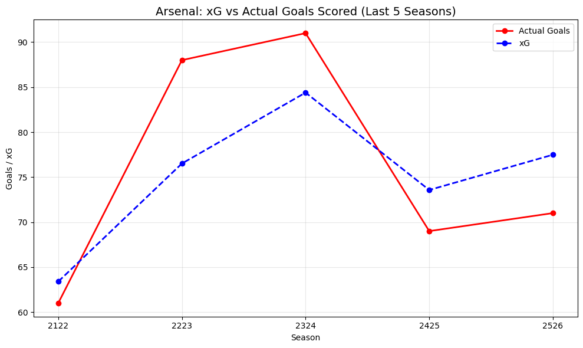
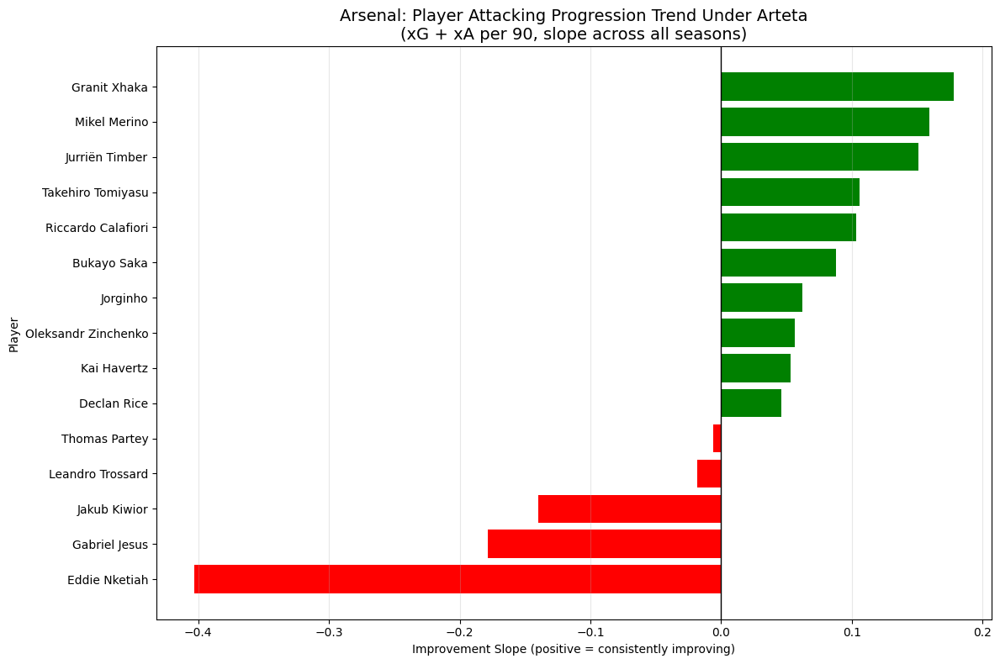
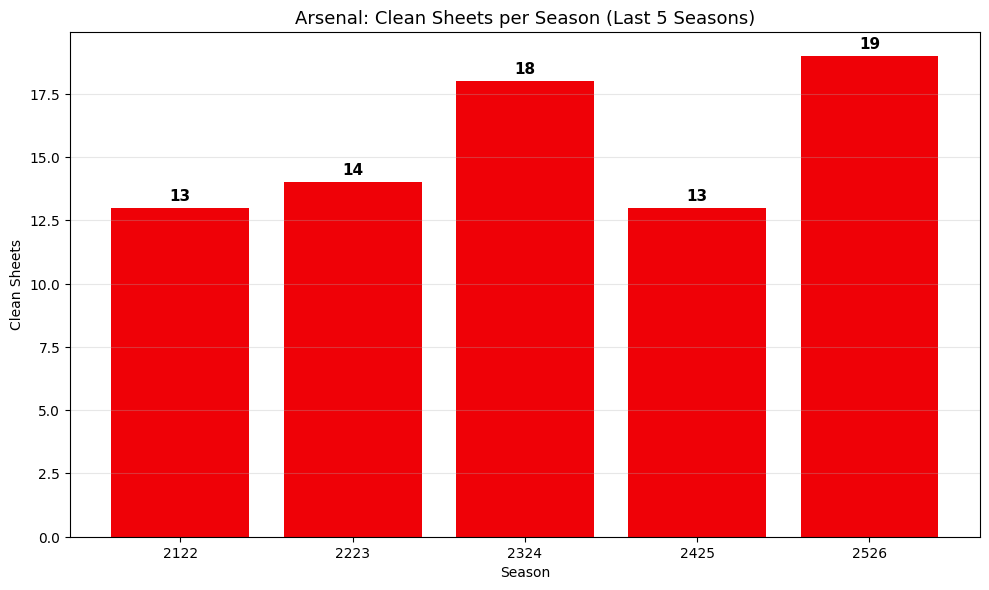
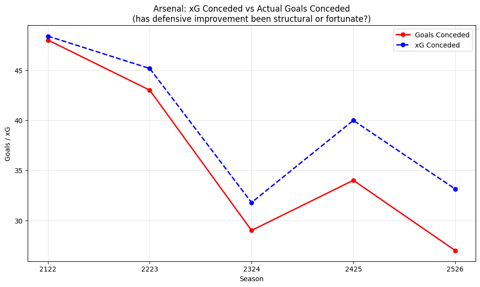
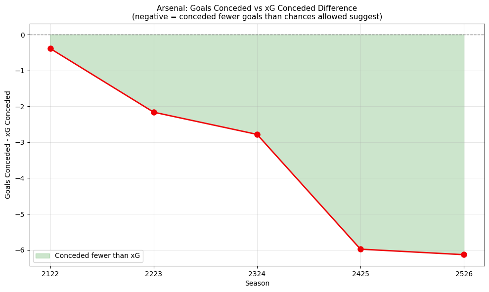
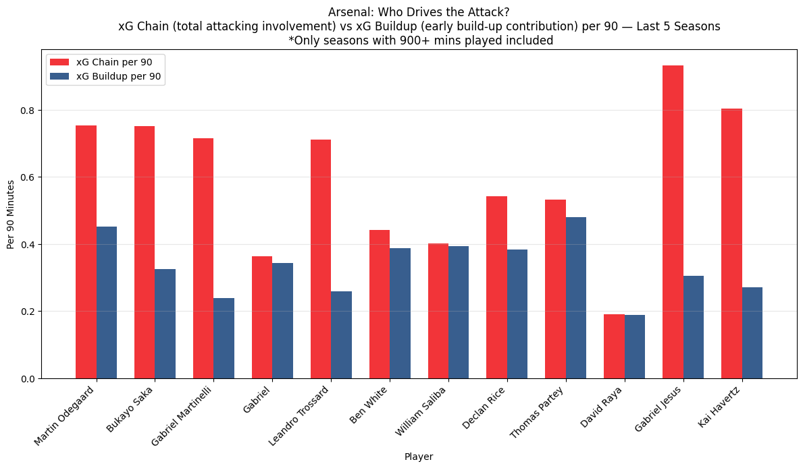

# Arsenal FC Data Pipeline

An end-to-end data pipeline that extracts, transforms and loads Premier League and Arsenal FC statistics from FBref and Understat into a PostgreSQL database, with analytical insights covering the last 5 seasons of Mikel Arteta's tenure.

Built as a portfolio project to demonstrate data engineering skills including ETL pipeline design, database management, testing and data visualisation.

---

## Tech Stack

- **Python** — pipeline orchestration, data cleaning, analysis and visualisation
- **PostgreSQL** — data storage and querying
- **soccerdata** — FBref and Understat scraping
- **pandas / numpy** — data transformation
- **SQLAlchemy / psycopg2** — database connection and loading
- **matplotlib / plotly** — visualisation
- **pytest** — pipeline integrity testing
- **schedule** — automated weekly pipeline runs
- **python-dotenv** — secure credential management

---

## Project Structure
Arsenal-FC-Data-Pipeline/
├── extract/
│   └── extract.py          # Scrapes FBref and Understat
├── transform/
│   ├── explore.py          # Data exploration and profiling
│   └── transform.py        # Cleaning, filtering and reshaping
├── load/
│   └── load.py             # Loads clean data into PostgreSQL
├── analysis/
│   └── analysis.py         # 5 analytical questions with visualisations
├── tests/
│   └── test_pipeline.py    # pytest test suite
├── docs/
│   ├── index.html          # GitHub Pages landing page
│   └── q3_pressing_vs_points.html
├── data/                   # Raw and clean CSVs (gitignored)
├── pipeline.py             # Master pipeline script 
├── requirements.txt
└── README.md

---

## Data Sources

| Source | Data | Coverage |
|---|---|---|
| FBref (via soccerdata) | Team standard and shooting stats | All Premier League top 6, last 5 seasons |
| Understat (via soccerdata) | xG, xGA, PPDA, match stats, player xG/xA | All top 6 matches + Arsenal players, last 5 seasons |

---

## Setup

**1. Clone the repo**
```bash
git clone https://github.com/Shane_Libera7/Arsenal-FC-Data-Pipeline.git
cd Arsenal-FC-Data-Pipeline
```

**2. Create and activate virtual environment**
```bash
python3 -m venv venv
source venv/bin/activate
```

**3. Install dependencies**
```bash
pip install -r requirements.txt
```

**4. Create a `.env` file in the project root**
DB_HOST=localhost
DB_PORT=5432
DB_NAME=arsenal_pipeline
DB_USER=your_username
DB_PASSWORD=your_password

**5. Create the PostgreSQL database**
```bash
psql postgres -c "CREATE DATABASE arsenal_pipeline;"
```

**6. Run the pipeline**
```bash
python3 pipeline.py --run-now
```

**7. Run the tests**
```bash
pytest tests/test_pipeline.py -v
```

**8. Run the analysis**
```bash
python3 analysis/analysis.py
```

---

## How the Pipeline Works
FBref / Understat
|
extract/extract.py     -- raw CSVs saved to data/
|
transform/transform.py -- clean CSVs saved to data/
|
load/load.py           -- data loaded into PostgreSQL

The pipeline runs automatically every Monday at 6am to pick up the latest match results. To trigger manually:

```bash
python3 pipeline.py --run-now
```

All runs are logged to `pipeline.log` with timestamps.

---

## Analysis and Key Findings

### Q1 - How has Arsenal's xG compared to actual goals across the last 5 seasons?

Arsenal's highest scoring seasons were 22/23 and 23/24, both significantly outperforming their xG. The title winning 25/26 season and 23/24 were Arsenal's two highest xG generating seasons, suggesting the attacking quality was consistently elite even when results did not reflect it.

The 24/25 season showed the impact of Arsenal's historically severe injury crisis as goals and xG both dipped yet xG never dropped below 70. This indicates Arteta's system remained structurally sound despite losing virtually every first-choice attacker at various points. The title winning season saw both metrics recover strongly.



---

### Q2 - Which Arsenal players showed the greatest improvement under Arteta?

Granit Xhaka's attacking progression in 22/23 was transformative, arguably the single biggest tactical success of Arteta's early tenure, turning a much-maligned defensive midfielder into a marauding number 8 who played a big role in Arsenal's title charge. He carried that development to Leverkusen where he went unbeaten, and continued it at Sunderland this season taking a newly promoted side to European football.

Mikel Merino's slope is one of the most interesting findings as his versatility allowed Arteta to deploy him as a makeshift number 9 during the 24/25 injury crisis, exceeding expectations including a significant contribution in the demolition of Real Madrid in the Champions League. He has also shown contributions before his injury in Arsenal's title winning season with cruical goals against Newcastle away and the opener against Brentford at home.

The fullback data reflects Arteta's tactical evolution as both Timber and Calafiori show significant attacking progression, consistent with Arteta's system of pushing fullbacks into half spaces during the attacking phase. This tactic however has some downsides as some may feel as though timber moving into more central areas and leaving Saka out wide was to the detriment of the team as it left our best attacker in the touchline rather than making things happen in and around the box. This was no longer the case though after Timber's injury and the re introduction of Ben White into the side had Saka more involved in general and was able to do what he does best, particularly highlighted in 25/26 game against Fulham at home.


---

### Q3 - Does pressing intensity correlate with league points for the top 6?

The 21/22 season is the most telling data point as City and Liverpool both pressed at the highest intensity and hit the 90 point threshold, while Arsenal, Spurs and United were the three least pressing sides and all significantly underperformed. This suggests 21/22 may have been the last season where high pressing gave a truly decisive advantage before the rest of the league adapted.

By 23/24 the correlation had weakened as seen when Spurs had the highest pressing intensity of any top 6 side yet finished on just 66 points. Arsenal's title winning season averaged in the mid range of their pressing statistics in the dataset, suggesting pressing was a contributing factor but no longer a guarantee of points.

[View Interactive Chart](https://Shane-Libera7.github.io/Arsenal-FC-Data-Pipeline/q3_pressing_vs_points.html)


---

### Q4 - How has Arsenal's defensive solidity evolved and does xG conceded tell the real story?

Clean sheets were highest in the title winning 25/26 season and 23/24. The data reveals a clear step change between 22/23 and 23/24 as both xG conceded and goals conceded dropped significantly, suggesting Arteta made a deliberate tactical shift toward defensive solidity after the title collapse.

The xG conceded vs goals conceded difference from 23/24 onwards points strongly to David Raya's impact once fully settled due to consistently outperforming his xG conceded in both the title challenge and the injury-ravaged 24/25 season.




---

### Q5 - Which Arsenal players contribute most to build-up play?

It's no surprise that both Odegaard and Saka dominate both xG chain and xG buildup across the dataset, confirming Arteta's system is fundamentally built around these two players. Odegaard's particularly high xG buildup relative to his xG chain highlights his role as both a deep creator and final third contributor.

The data also illustrates the risk of this dependency as Odegaard's dips in form and fitness in recent seasons have impacted the whole attacking system, supporting the case that signing Eze and introducing Lewis-Skelly into midfield provided the creative variety needed to finally win the title without over-relying on Odegaard to unlock defences.

Gabriel Jesus and Havertz both show high numbers in their active seasons, confirming their value to Arsenal's build-up went far beyond their goal tallies.


---

## Running Tests

```bash
pytest tests/test_pipeline.py -v
```

The test suite covers row counts, season coverage, filter integrity, null checks, value range validation and database connectivity.

---

## Automated Updates

The pipeline updates automatically every Monday at 6am:

```bash
python3 pipeline.py
```

Data covers seasons 2021/22 through 2025/26